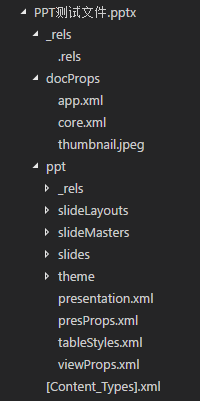

# Office 文件解析  

## 概述 - Office 解析相关协议

这里所讲的 Office 文件指的是微软 Office2007 及以后的 PPT/EXCEL/WORD 等文件格式，因为 Office2007 以前的文件是用二进制格式定义的，不在本文的讨论内容中。

Office2007 以后的文件格式属于 OOXML 文件格式，OOXML 是基于 zip+xml 定义的。

OOXML 全称 `Office Open XML File Formats`，最初是由 [`ECMA-376`](ecma-376) 定义的，它目前已经到第六版。后来 [`ISO/IEC 29500`](iso/iec-29500) 也开始掺和OOXML格式的定义，不过可以认为从 [`ECMA-376`](ecma-376) 的第2版开始，这两个标准是一样的。目前最新的 OOXML 标准是在 2016 年发布的 [`ECMA-376 5th edition`](ecma-376) 或者 [`ISO/IEC 29500:2016`](iso/iec-29500)。

微软的 Office 实现了OOXML格式，但不是全部，微软在 [这篇文章](OfficeStandardSupport) 中描述了其对标准的支持情况。

> 由于 EMCA 文档可以免费在网上下载的，而 ISO 文档需要付费才能获取，因此下文涉及 OOXML 的部分都是基于 ECMA-376 文档。

## OOXML

OOXML 主体部分是由 OPC 协议以及各种 ML 协议构成，在这些之外也定义了文档的兼容性、扩展性等内容。

### OPC - Open Package Convention

> 关于 OPC 的详细内容请参考 `ECMA-376,Fourth Edition,Part 2`。

OPC 中文名`开放打包协定`，是一种基于 zip+xml 定义的文件存储格式。一个 OPC 文件（不管其文件后缀是什么）本质上就是一个 zip 文件，你可以用任何常见的解压软件进行解压，解压后你看到的那些文件的组织结构，就是以 OPC 定义的方式存储的。下图是一个PPTX文件解压后的目录结构：



因此，理解 OPC 的重点就在于 `zip压缩包中的文件是如何组织的？它们的关系是怎样的？`

OPC 中有3个重要的概念要理解：`Part` , `Relationship` , `ContentTypes`。

#### `Part`

Part 可以简单理解为 zip 中的文件，每一个文件都是一个 `Part` ，它可以是任何格式，比如图片，xml文件等。在 Office 文件中，各种 Markup Language 定义的内容就作为 XML 存储在 `Part` 中。

#### `Relationship`

`Relationship` 是一种特殊的 `Part` ，它描述了各 `Part` 之间的依赖关系。根据OPC协议的规定，所有的 `Relationship` 都必须存储在名为 `_rels` 的文件夹中，并且所有 `Relationship` 的文件名都必须以 `.rels` 为后缀。

每一个 `Part` 根据业务需求都可以有对应的 `Relationship` 文件，比如在 PPTX 文件中，有一个 Part 为 `/ppt/presentation.xml` ，它对应的 Relationship 文件（只能）为`/ppt/_rels/presentation.xml.rels` ，不能是任何其它名字或者位置的文件。下面是一个 PPTX 文件中的 presentation.xml.rels 文件：

```XML
<?xml version="1.0" encoding="UTF-8" standalone="yes"?>
<Relationships xmlns="http://schemas.openxmlformats.org/package/2006/relationships">
    <Relationship Id="rId3" Type="http://schemas.openxmlformats.org/officeDocument/2006/relationships/slide" Target="slides/slide2.xml"/>
    <Relationship Id="rId7" Type="http://schemas.openxmlformats.org/officeDocument/2006/relationships/tableStyles" Target="tableStyles.xml"/>
    <Relationship Id="rId2" Type="http://schemas.openxmlformats.org/officeDocument/2006/relationships/slide" Target="slides/slide1.xml"/>
    <Relationship Id="rId1" Type="http://schemas.openxmlformats.org/officeDocument/2006/relationships/slideMaster" Target="slideMasters/slideMaster1.xml"/>
    <Relationship Id="rId6" Type="http://schemas.openxmlformats.org/officeDocument/2006/relationships/theme" Target="theme/theme1.xml"/>
    <Relationship Id="rId5" Type="http://schemas.openxmlformats.org/officeDocument/2006/relationships/viewProps" Target="viewProps.xml"/>
    <Relationship Id="rId4" Type="http://schemas.openxmlformats.org/officeDocument/2006/relationships/presProps" Target="presProps.xml"/>
</Relationships>
```

`Relationship` 文件的根节点是 `RelationShips`, 它是 `Relationship` 节点的集合，每一个 `Relationship` 节点都代表一个依赖关系。它的各个属性的意义如下：  

| 属性名 | 是否必须 | 说明 |
| ------| ------ | ------ |
| `Id` | 是 | 唯一标识符，在当前文件中是唯一的，不同文件中可以重复 |
| `Type` | 是 | `Target` 的文件类型 |
| `Target` | 是 | 目标 `Part` 的路径，可以用相对路径也可以用绝对路径 | 
| `TargetMode` | 否 | 目标的类型，值可以是 `Internal` 或者 `External` （默认是`Internal`）,表示 `Target` 是OPC文件内部的还是外部的 |

#### `ContentTypes`

`ContentTypes` 在zip压缩包的根目录下，文件名为 `[Content_Types].xml` ，它记录了该OPC文件中除了他自己以外的所有文件的类型。下面是一个PPTX文件的 `ContentTypes` 文件：

```XML
<?xml version="1.0" encoding="UTF-8" standalone="yes"?>
<Types xmlns="http://schemas.openxmlformats.org/package/2006/content-types">
    <Default Extension="jpeg" ContentType="image/jpeg"/>
    <Default Extension="rels" ContentType="application/vnd.openxmlformats-package.relationships+xml"/>
    <Default Extension="xml" ContentType="application/xml"/>
    <Override PartName="/ppt/presentation.xml" ContentType="application/vnd.openxmlformats-officedocument.presentationml.presentation.main+xml"/>
    <Override PartName="/ppt/slideMasters/slideMaster1.xml" ContentType="application/vnd.openxmlformats-officedocument.presentationml.slideMaster+xml"/>
    <Override PartName="/ppt/slides/slide1.xml" ContentType="application/vnd.openxmlformats-officedocument.presentationml.slide+xml"/>
    <Override PartName="/ppt/slides/slide2.xml" ContentType="application/vnd.openxmlformats-officedocument.presentationml.slide+xml"/>
    <Override PartName="/ppt/presProps.xml" ContentType="application/vnd.openxmlformats-officedocument.presentationml.presProps+xml"/>
    <Override PartName="/ppt/viewProps.xml" ContentType="application/vnd.openxmlformats-officedocument.presentationml.viewProps+xml"/>
    <Override PartName="/ppt/theme/theme1.xml" ContentType="application/vnd.openxmlformats-officedocument.theme+xml"/>
    <Override PartName="/ppt/tableStyles.xml" ContentType="application/vnd.openxmlformats-officedocument.presentationml.tableStyles+xml"/>
    <Override PartName="/ppt/slideLayouts/slideLayout1.xml" ContentType="application/vnd.openxmlformats-officedocument.presentationml.slideLayout+xml"/>
    <Override PartName="/ppt/slideLayouts/slideLayout2.xml" ContentType="application/vnd.openxmlformats-officedocument.presentationml.slideLayout+xml"/>
    <Override PartName="/docProps/core.xml" ContentType="application/vnd.openxmlformats-package.core-properties+xml"/>
    <Override PartName="/docProps/app.xml" ContentType="application/vnd.openxmlformats-officedocument.extended-properties+xml"/>
</Types>
```

其中有两种标签 `Default` 和 `Override` , `Default` 指明了拥有文件后缀名和文件类型的对应关系， `Override` 指明了某一个文件的文件类型。

比如：`<Default Extension="jpeg" ContentType="image/jpeg"/>` 的意思是后缀为 `jpeg` 的文件都是 `image/jpeg` 类型的文件，因此在OPC中不建议根据文件后缀名来判断一个文件的类型，而应该根据 `ContentTypes` 文件中记录的信息来判断文件类型。


### 各种 `ML` 语言介绍 - * Markup Language

> 关于各种 `ML` 语言的详细信息请参考 `ECMA-376,Fifth Edition,Part 1` 。

`Markup Language (ML)` 译为 `标记语言`，是一种用 XML 来描述数据的"语言"，比如：

| *ML | 全名 | 说明 | 
| ----- | ------ | ------ |
| `PML` | `Presentation Markup Language` | PPT 中各种数据的描述 | 
| `WML` | `Wordprocessing Markup Language` | Word 中数据的描述 |
| `SML` | `Spreadsheet Markup Language` | Excel 中数据的描述 |
| `DML` | `Drawing Markup Language` |  Office 所有格式中都可以使用，用来描述矢量图形，图表等 |
| `SharedML` | `Shared Markup Language` | 描述了文档属性，音视频，图片，文档主题等内容，它被所有Office文件使用 |

比如之前提到的 `presentation.xml` 文件，它的文件内容就是在 `PML` 中定义的。具体信息可以查看 [`ECMA-376`](ecma-376) 第5版的第一部分内容。

这里简单介绍一下 `ECMA-376,Fifth Edition,Part 1` 的组织结构，方便大家阅读：


## POI/NPOI

### POI 中的名词真的牛 - POI 的实现思路

## 我要自己解析 PPT

### 解析 PPT 的流程

## 总结


[ecma-376]: http://www.ecma-international.org/publications/standards/Ecma-376.htm
[iso/iec-29500]: http://www.iso.org/iso/home/store/catalogue_tc/catalogue_detail.htm?csnumber=71691
[OfficeStandardSupport]: https://msdn.microsoft.com/en-us/library/gg548604(v=office.12).aspx