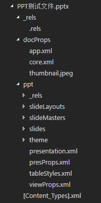

# Office 文件解析入门  

## 概述 - Office 解析相关协议

这里所讲的 Office 文件指的是微软 Office2007 及以后的 PPT/EXCEL/WORD 等文件格式，因为 Office2007 以前的文件是用二进制格式定义的，不在本文的讨论内容中。

Office2007 以后的文件格式属于 OOXML 文件格式，OOXML 是基于 zip+xml 定义的。

OOXML 全称 `Office Open XML File Formats`，最初是由 [`ECMA-376`][ecma-376] 定义的，它目前已经到第六版。后来 [`ISO/IEC 29500`][iso/iec-29500] 也开始掺和OOXML格式的定义，不过可以认为从 [`ECMA-376`][ecma-376] 的第2版开始，这两个标准是一样的。目前最新的 OOXML 标准是在 2016 年发布的 [`ECMA-376 5th edition`][ecma-376] 或者 [`ISO/IEC 29500:2016`][iso/iec-29500]。

微软的 Office 实现了OOXML格式，但不是全部，微软在 [这篇文章][OfficeStandardSupport] 中描述了其对标准的支持情况。

`OOXML = OPC + *ML` ，下面会分别介绍 `OPC` 和 `*ML`。

> 由于 EMCA 文档可以免费在网上下载的，而 ISO 文档需要付费才能获取，因此下文的内容都是基于 ECMA-376 文档。

## OPC - Open Package Convention

> 关于 OPC 的详细内容请参考 `ECMA-376,Fourth Edition,Part 2`。

OPC 中文名`开放打包协定`，是一种基于 zip+xml 定义的文件存储格式。一个 OPC 文件（不管其文件后缀是什么）本质上就是一个 zip 文件，你可以用任何常见的解压软件进行解压，解压后你看到的那些文件的组织结构，就是以 OPC 定义的方式存储的。下图是一个PPTX文件解压后的目录结构：



OPC 中有3个重要的概念要理解：`Part` , `Relationship` , `ContentTypes`。

### `Part`

Part 可以简单理解为 zip 中的文件，每一个文件都是一个 `Part` ，它可以是任何格式，比如图片，xml文件等。在 Office 文件中，各种 Markup Language 定义的内容就作为 XML 存储在 `Part` 中。

### `Relationship`

`Relationship` 是一种特殊的 `Part` ，它描述了各 `Part` 之间的依赖关系。根据OPC协议的规定，所有的 `Relationship` 都必须存储在名为 `_rels` 的文件夹中，并且所有 `Relationship` 的文件名都必须以 `.rels` 为后缀。

每一个 `Part` 根据业务需求都可以有对应的 `Relationship` 文件，比如在 PPTX 文件中，有一个 Part 为 `/ppt/presentation.xml` ，它对应的 Relationship 文件（只能）为`/ppt/_rels/presentation.xml.rels` ，不能是任何其它名字或者位置的文件。下面是一个 PPTX 文件中的 presentation.xml.rels 文件：

```XML
<?xml version="1.0" encoding="UTF-8" standalone="yes"?>
<Relationships xmlns="http://schemas.openxmlformats.org/package/2006/relationships">
    <Relationship Id="rId3" Type="http://schemas.openxmlformats.org/officeDocument/2006/relationships/slide" Target="slides/slide2.xml"/>
    <Relationship Id="rId7" Type="http://schemas.openxmlformats.org/officeDocument/2006/relationships/tableStyles" Target="tableStyles.xml"/>
    <Relationship Id="rId2" Type="http://schemas.openxmlformats.org/officeDocument/2006/relationships/slide" Target="slides/slide1.xml"/>
    <Relationship Id="rId1" Type="http://schemas.openxmlformats.org/officeDocument/2006/relationships/slideMaster" Target="slideMasters/slideMaster1.xml"/>
    <Relationship Id="rId6" Type="http://schemas.openxmlformats.org/officeDocument/2006/relationships/theme" Target="theme/theme1.xml"/>
    <Relationship Id="rId5" Type="http://schemas.openxmlformats.org/officeDocument/2006/relationships/viewProps" Target="viewProps.xml"/>
    <Relationship Id="rId4" Type="http://schemas.openxmlformats.org/officeDocument/2006/relationships/presProps" Target="presProps.xml"/>
</Relationships>
```

`Relationship` 文件的根节点是 `RelationShips`, 它是 `Relationship` 节点的集合，每一个 `Relationship` 节点都代表一个依赖关系。它的各个属性的意义如下：  

| 属性名 | 是否必须 | 说明 |
| ------| ------ | ------ |
| Id | 是 | 唯一标识符，在当前文件中是唯一的，不同文件中可以重复 |
| Type | 是 | `Target` 的文件类型 |
| Target | 是 | 目标 `Part` 的路径，可以用相对路径也可以用绝对路径 | 
| TargetMode | 否 | 目标的类型，值可以是 `Internal` 或者 `External` （默认是`Internal`）,表示 `Target` 是OPC文件内部的还是外部的 |

### `ContentTypes`

`ContentTypes` 在zip压缩包的根目录下，文件名为 `[Content_Types].xml` ，它记录了该OPC文件中除了他自己以外的所有文件的类型。下面是一个PPTX文件的 `ContentTypes` 文件：

```XML
<?xml version="1.0" encoding="UTF-8" standalone="yes"?>
<Types xmlns="http://schemas.openxmlformats.org/package/2006/content-types">
    <Default Extension="jpeg" ContentType="image/jpeg"/>
    <Default Extension="rels" ContentType="application/vnd.openxmlformats-package.relationships+xml"/>
    <Default Extension="xml" ContentType="application/xml"/>
    <Override PartName="/ppt/presentation.xml" ContentType="application/vnd.openxmlformats-officedocument.presentationml.presentation.main+xml"/>
    <Override PartName="/ppt/slideMasters/slideMaster1.xml" ContentType="application/vnd.openxmlformats-officedocument.presentationml.slideMaster+xml"/>
    <Override PartName="/ppt/slides/slide1.xml" ContentType="application/vnd.openxmlformats-officedocument.presentationml.slide+xml"/>
    <Override PartName="/ppt/slides/slide2.xml" ContentType="application/vnd.openxmlformats-officedocument.presentationml.slide+xml"/>
    <Override PartName="/ppt/presProps.xml" ContentType="application/vnd.openxmlformats-officedocument.presentationml.presProps+xml"/>
    <Override PartName="/ppt/viewProps.xml" ContentType="application/vnd.openxmlformats-officedocument.presentationml.viewProps+xml"/>
    <Override PartName="/ppt/theme/theme1.xml" ContentType="application/vnd.openxmlformats-officedocument.theme+xml"/>
    <Override PartName="/ppt/tableStyles.xml" ContentType="application/vnd.openxmlformats-officedocument.presentationml.tableStyles+xml"/>
    <Override PartName="/ppt/slideLayouts/slideLayout1.xml" ContentType="application/vnd.openxmlformats-officedocument.presentationml.slideLayout+xml"/>
    <Override PartName="/ppt/slideLayouts/slideLayout2.xml" ContentType="application/vnd.openxmlformats-officedocument.presentationml.slideLayout+xml"/>
    <Override PartName="/docProps/core.xml" ContentType="application/vnd.openxmlformats-package.core-properties+xml"/>
    <Override PartName="/docProps/app.xml" ContentType="application/vnd.openxmlformats-officedocument.extended-properties+xml"/>
</Types>
```

其中有两种标签 `Default` 和 `Override` , `Default` 指明了拥有文件后缀名和文件类型的对应关系， `Override` 指明了某一个文件的文件类型。

比如：`<Default Extension="jpeg" ContentType="image/jpeg"/>` 的意思是后缀为 `jpeg` 的文件都是 `image/jpeg` 类型的文件，因此在OPC中不建议根据文件后缀名来判断一个文件的类型，而应该根据 `ContentTypes` 文件中记录的信息来判断文件类型。


## `*ML (* Markup Language)`

> 关于各种 `ML` 语言的详细信息请参考[ `ECMA-376,Fifth Edition,Part 1`][ecma-376] 。

`Markup Language (ML)` 译为 `标记语言`，是一种用 XML 来描述数据的"语言"，比如：

| *ML | 全名 | 说明 | 
| ----- | ------ | ------ |
| PML | Presentation Markup Language | PPT 中各种数据的描述 | 
| WML | Wordprocessing Markup Language | Word 中数据的描述 |
| SML | Spreadsheet Markup Language | Excel 中数据的描述 |
| DML | Drawing Markup Language |  Office 所有格式中都可以使用，用来描述矢量图形，图表等 |
| SharedML | Shared Markup Language | 描述了文档属性，音视频，图片，文档主题等内容，它被所有Office文件使用 |

比如之前提到的 `presentation.xml` 文件，它的文件内容就是在 `PML` 中定义的。具体信息可以查看 `ECMA-376,Fifth Edition,Part 1`。但是，ECMA-376 太长了，还没看就头疼，怎么办。

首先了解一下在 EMCA-376 中用来定义各种 ML 语言的 [XSD][xsd]：

### [`XSD - XML Schema Definition`][xsd] 或者 [`XML Schema`][xsd]

[`XSD`][xsd] 类似 [`DTD`][dtd]，它们有相似的作用。在 `ECMA-376` 中，所有的 `Markup Language` 都是 XML 格式的，而这些 XML 的具体节点内容，都是用 `XSD` 来定义的，所以我们要对它有一定的了解：

> XML Schema(XSD) 的作用：
> * 定义可出现在文档中的元素
> * 定义可出现在文档中的属性
> * 定义哪个元素是子元素
> * 定义子元素的次序
> * 定义子元素的数目
> * 定义元素是否为空，或者是否可包含文本
> * 定义元素和属性的数据类型
> * 定义元素和属性的默认值以及固定值  
> （可以在 [这里][xsd] 找到 `XSD` 的详细内容。）

在 `XSD` 中，有两个比较重要的概念：`Simple Type（简单类型）` 和 `Complex Type（复杂类型）`：

 名称 | 说明 | 
---------|----------| 
 Simple Type Element | 简单类型元素，指那些仅包含文本的元素。它不会包含任何其他的元素或属性。 比如：`<id>123</id>`，这里元素 `id` 就是简单类型元素。 | 
 Complex Type Element | 复杂类型元素，指那些可以包含其他任意元素或者属性的元素。 | 

比如在 PML 中定义 **页面大小（SlideSize）** 这个元素（节点）的 XSD 如下：

```XSD
<xsd:complexType name="CT_SlideSize"> 
    <xsd:attribute name="cx" type="ST_SlideSizeCoordinate" use="required"/> 
    <xsd:attribute name="cy" type="ST_SlideSizeCoordinate" use="required"/> 
    <xsd:attribute name="type" type="ST_SlideSizeType" use="optional" default="custom"/> 
</xsd:complexType>
```

可以看出 `CT_SlideSize` 是个 complexType（复杂类型） 的元素，并且它有三个 `attribute（属性）` ，分别是 `cx` , `cy` 和 `type`，根据它们 `type` 的前缀 `ST_` ，可以看出这三个属性都是简单类型的，并且是 `required` 的。如果你明白了这里的描述，再去看 ECMA-376 中各种 ML 语言的定义应该会简单一点。

**PS: 在看 ECMA-376 的时候可以先只看前 16 章的内容，只有160页左右，如果只算内容的话更少，后面的将近 5000 页都可以解析哪部分就去看哪部分就行了。言外之意就是，其实也没有想象中的那么唬人。JUST DO IT !**

## PPTX 解析的基本流程

这里以 PPTX 的解析为例，其它的 WORD 或者 EXCEL 可以触类旁通。

基本流程如下：

1. 读取 `/[Content_Types].xml` 文件，获取到所有文件的类型；  
  _这部分需要了解 OPC 中关于 ContentTypes 的内容。_
2. 读取 `/_rels/.rels` 这个所谓的 `Package Relationship` 文件，获取 `presentation.xml` 文件的位置，比如 `/ppt/presentation.xml`；  
  _这部分需要了解 OPC 中关于 Relationship 的内容以及 PML 的基本内容。_
3. 读取 `/ppt/presentation.xml` 文件以及其关联的 Relationship 文件 `/ppt/_rels/presentation.xml.rels`，得到该PPT所有页面文件的存储位置，比如 `/ppt/slides/slide1.xml`，以及 slideMaster（母版）文件的存储位置，比如 `/ppt/slideMasters/slideMaster1.xml`，以及 slideLayout（板式）等相关文件的存储位置；  
  _这部分需要了解 PML 中关于 Presentation 的定义，也就是 PML 的 XSD 中定义的 `CT_Presentation` 类型。这个时候可以去详细的阅读 Presentation 章节的详细信息了。_
4. 读取 `/ppt/slides/slide1.xml` 文件内容以及其关联的 Relationship    `/ppt/slides/_rels/slide1.xml.rels`，可以得到该页面的所有元素信息；  
  _这部分要完整解析就需要了解所有 PML、DML、SharedML 中的内容了。_

不知道看到这里你还要不要自己解析啊？如果不愿意了，那大名鼎鼎的 POI 也许可以救你于水深火热。

## POI/NPOI

POI 是 Apache 的项目，[这里][poi] 是它的官网（NPOI 是 POI 的 .NET 版本）。背景知识我就不介绍了，这里摘自维基百科对它模块划分的介绍，可以在自己解析的时候参考：

```
POIFS (Poor Obfuscation Implementation File System) – This component reads and writes Microsoft's OLE 2 Compound document format. Since all Microsoft Office files are OLE 2 files, this component is the basic building block of all the other POI elements. POIFS can therefore be used to read a wider variety of files, beyond those whose explicit decoders are already written in POI.（也就是OPC模块）
HSSF (Horrible SpreadSheet Format) – reads and writes Microsoft Excel (XLS) format files. It can read files written by Excel 97 onwards; this file format is known as the BIFF 8 format. As the Excel file format is complex and contains a number of tricky characteristics, some of the more advanced features cannot be read.（）
XSSF (XML SpreadSheet Format) – reads and writes Office Open XML (XLSX) format files. Similar feature set to HSSF, but for Office Open XML files.
HPSF (Horrible Property Set Format) – reads "Document Summary" information from Microsoft Office files. This is essentially the information that one can see by using the File|Properties menu item within an Office application.
HWPF (Horrible Word Processor Format) – aims to read and write Microsoft Word 97 (DOC) format files. This component is in initial stages of development.
XWPF (XML Word Processor Format) – similar feature set to HWPF, but for Office Open XML files.
HSLF (Horrible Slide Layout Format) – a pure Java implementation for Microsoft PowerPoint files. This provides the ability to read, create and edit presentations (though some things are easier to do than others)
HDGF (Horrible DiaGram Format) – an initial pure Java implementation for Microsoft Visio binary files. It provides an ability to read the low level contents of the files.
HPBF (Horrible PuBlisher Format) – a pure Java implementation for Microsoft Publisher files.
HSMF (Horrible Stupid Mail Format[7][better source needed]) – a pure Java implementation for Microsoft Outlook MSG files.[8]
DDF (Dreadful Drawing Format) – a package for decoding the Microsoft Office Drawing format.
```

需要注意的是 POI 貌似对 PPT 的支持比较弱？

## 最后

你应该只是需要部分解析 Office 格式吧？难道你想过完全解析么？太可怕了。


[ecma-376]: http://www.ecma-international.org/publications/standards/Ecma-376.htm
[iso/iec-29500]: http://www.iso.org/iso/home/store/catalogue_tc/catalogue_detail.htm?csnumber=71691
[OfficeStandardSupport]: https://msdn.microsoft.com/en-us/library/gg548604(v=office.12).aspx
[xsd]: http://www.w3school.com.cn/schema/index.asp
[dtd]: http://www.w3school.com.cn/dtd/index.asp
[poi]: https://poi.apache.org/index.html
